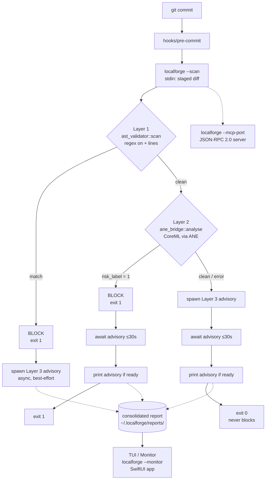

# LocalForge Flow

## Layers

| Layer | Module | Cost | Blocks? |
|---|---|---|---|
| 1 — AST regex | `ast_validator.rs` | <1 ms | Yes |
| 2 — CoreML classifier | `ane_bridge.rs` (ANE) | ~200 ms | Yes |
| 3 — Qwen advisory | `advisory_engine.rs` (MLX) | ~5–10 s, async | Never |

## Key points

- Only Layer 1 and Layer 2 can fail the commit (`exit 1`). Layer 3 is advisory-only and runs in the background regardless of the outcome of Layers 1/2.
- Layer 3 is spawned as soon as a decision path is known, so inference overlaps with the exit-code decision instead of adding latency serially.
- Every Layer 3 run writes one consolidated report per commit to `~/.localforge/reports/`, never one file per finding.
- The Swift TUI (`tui/`) and the SwiftUI macOS app both read from the same report/log stream produced by this pipeline — they observe, they don't participate in the block decision.
- `localforge --mcp-port <PORT>` exposes the same engine over JSON-RPC 2.0 for external tooling, independent of the git-hook path.
